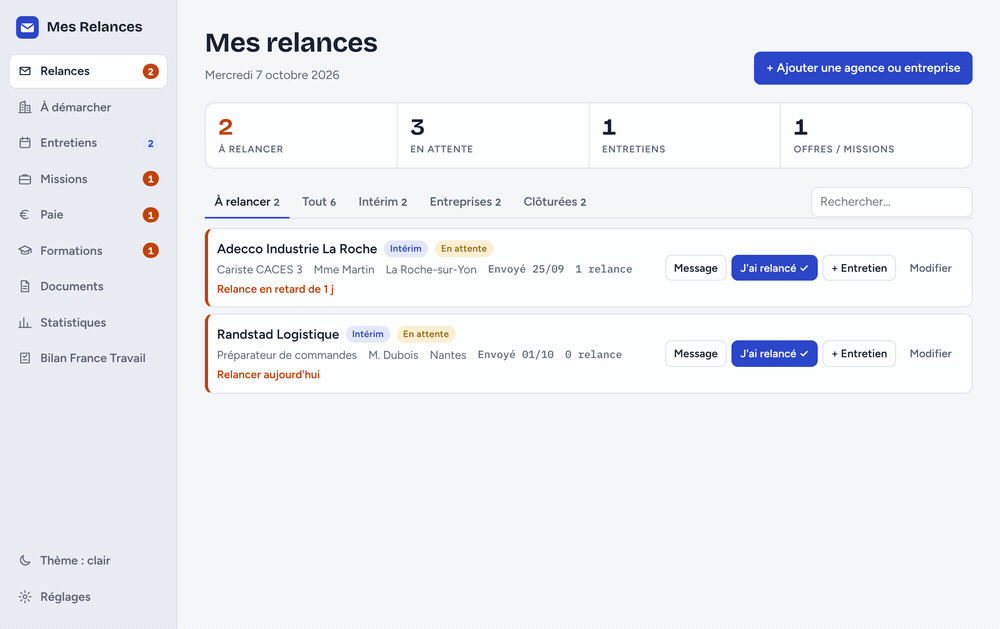
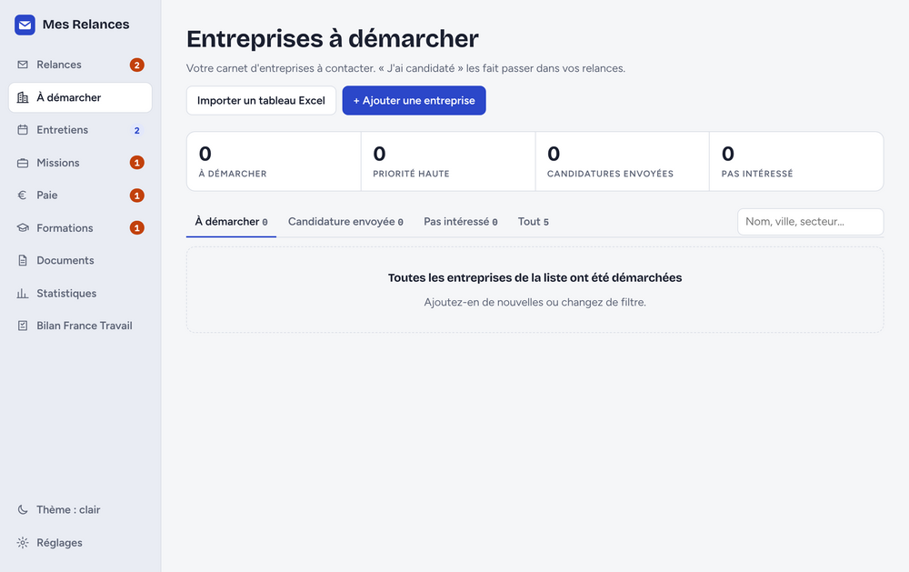
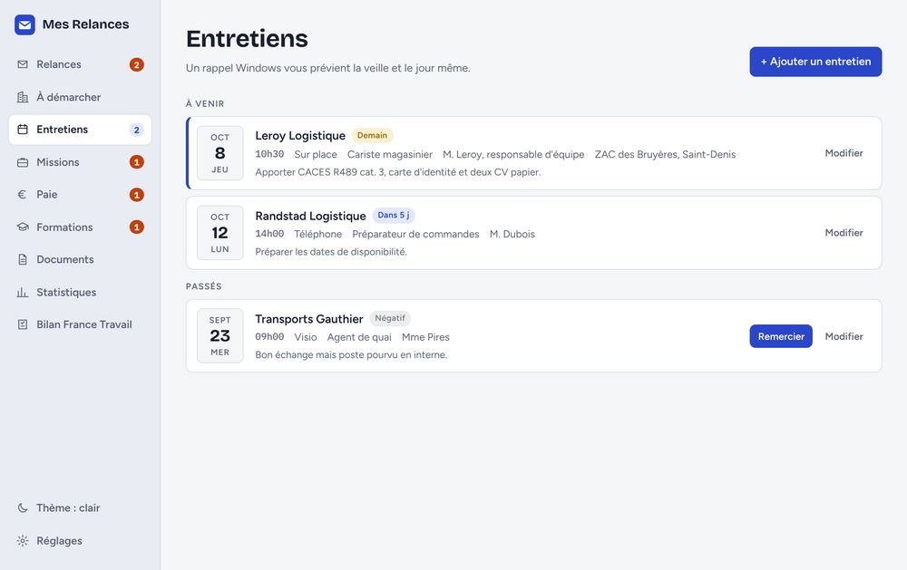
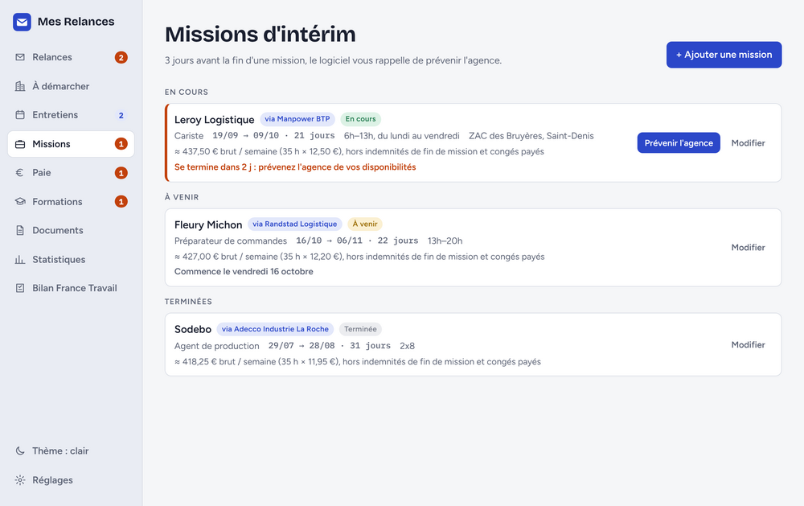
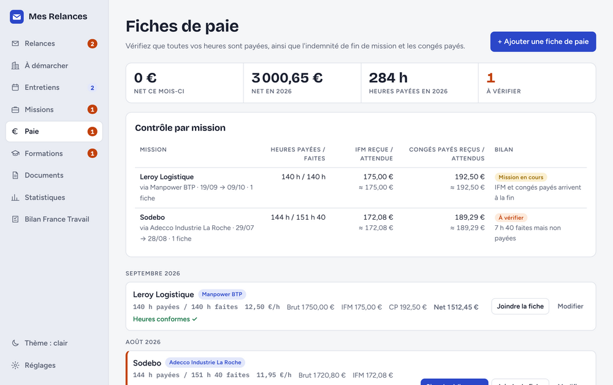
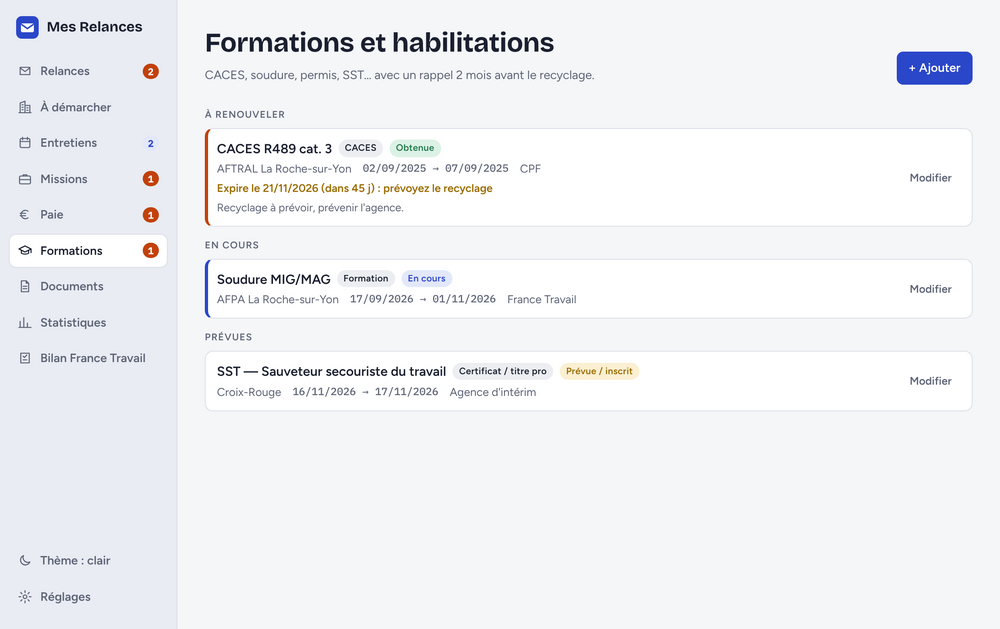
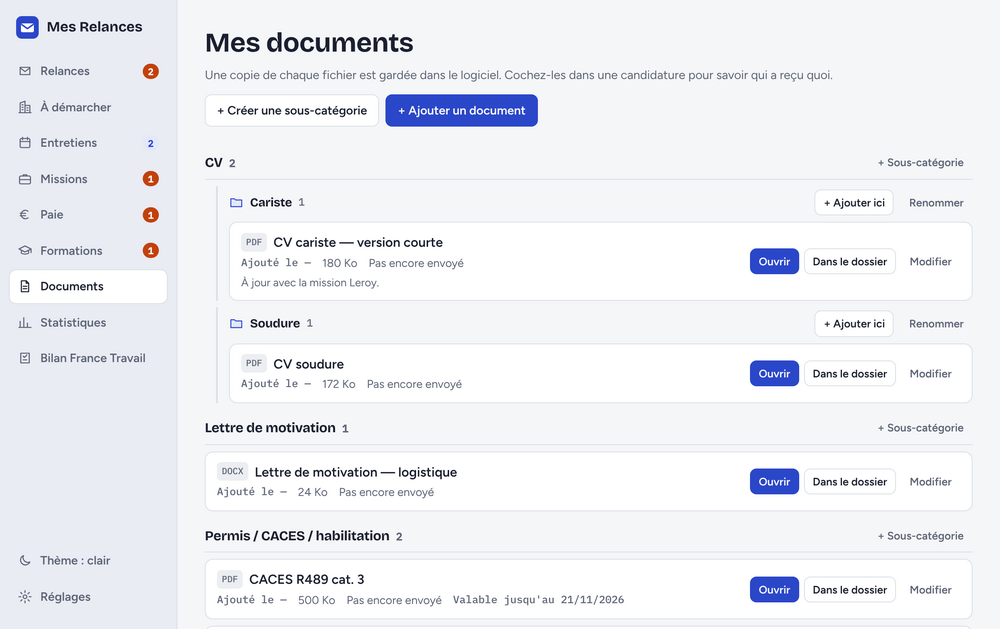
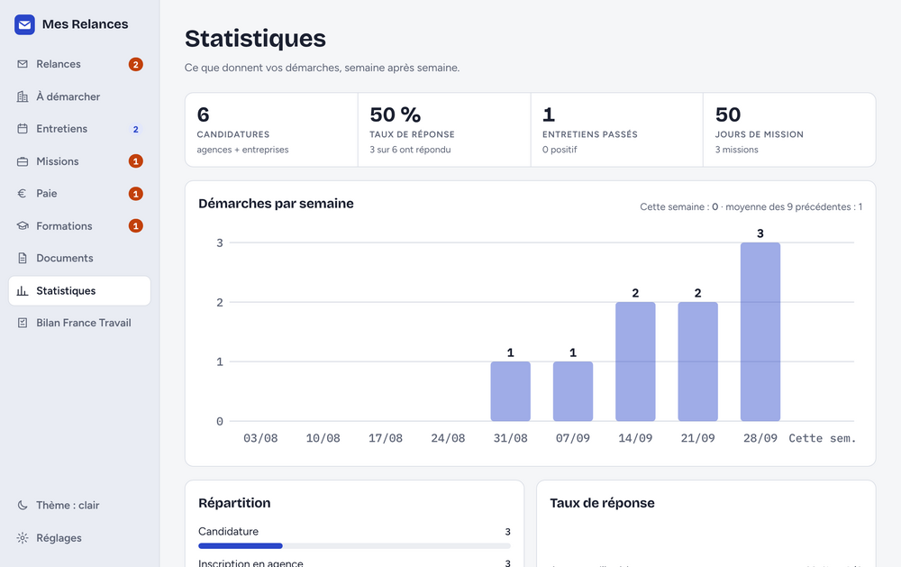
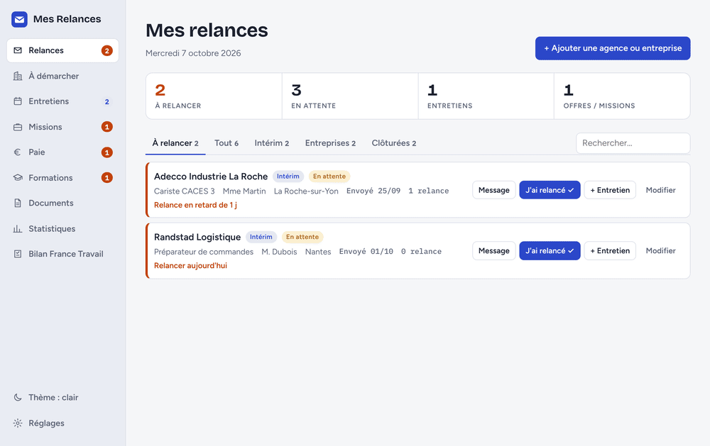

<div align="center">


# Mes Relances

**Le carnet de bord de votre recherche d'emploi — intérim et entreprises.**

Qui relancer aujourd'hui, quel message envoyer, quel entretien se prépare,
quelles heures n'ont pas été payées. Tout sur votre ordinateur, rien dans le cloud.

[](https://github.com/ikono85/Mes-Relances/releases)
[](https://www.electronjs.org/)
[](#installation)
[](LICENSE)
[](#vos-données)



</div>

---

## Pourquoi

Quand on cherche du travail, on candidate partout et on oublie. L'agence qui avait dit
« je vous rappelle » il y a trois semaines. L'entretien de jeudi dont on n'a pas préparé
les questions. Les 7 h du samedi qui ne sont jamais apparues sur la fiche de paie. Le CACES
qui expire dans deux mois.

**Mes Relances** garde tout ça à l'œil et vous dit, chaque matin, quoi faire aujourd'hui.

---

## Les écrans

### 📨 Relances — « qui je relance aujourd'hui ? »

Chaque agence et chaque entreprise a une date de prochaine relance, calculée toute seule
(4 jours pour l'intérim, 7 pour les entreprises — modifiable). Un clic sur **Message** et
le texte de la 1re, 2e ou 3e relance est prêt, adapté au canal : email, SMS ou aide-mémoire
pour l'appel.


### 🏢 À démarcher — le carnet d'entreprises

La liste de celles que vous n'avez pas encore contactées, classées par priorité.
Import possible depuis un tableau Excel enregistré en CSV (`;`).



### 📅 Entretiens — rappel la veille et le jour même

Lieu, interlocuteur, ce qu'il faut apporter. Et après l'entretien, le message de
remerciement est déjà écrit.



### 💼 Missions — ne pas laisser une mission se terminer dans le silence

Rappel **3 jours avant la fin** pour prévenir l'agence et enchaîner sur la suivante.



### 💶 Paie — vérifier ce qu'on vous doit

Heures faites comparées aux heures payées, indemnité de fin de mission (IFM) et
congés payés (ICCP) attendus mission par mission. L'écart saute aux yeux.



### 🎓 Formations — avant que ça n'expire

CACES, habilitations, permis, titres pro : rappel **2 mois avant** la date de recyclage.



### 📄 Documents — CV, lettres, diplômes

Rangés en catégories et sous-catégories, avec date d'expiration pour les pièces qui en ont une.



### 📊 Statistiques & Bilan France Travail

Démarches par semaine, taux de réponse, jours de mission. Et le bilan d'actes de recherche
d'emploi exportable en **PDF ou Excel**, à présenter lors d'un rendez-vous.



---

## Thème clair ou sombre

<div align="center">

</div>

---

## Installation

### Utiliser l'application

1. Téléchargez la dernière version dans [Releases](https://github.com/ikono85/Mes-Relances/releases).
2. Décompressez le dossier où vous voulez (Bureau, clé USB…).
3. Double-cliquez sur **`Mes Relances.exe`**.

> Si Windows affiche « Windows a protégé votre ordinateur » :
> **Informations complémentaires** → **Exécuter quand même**.
> C'est le message habituel pour une application sans certificat de signature payant.

### Développer

```bash
git clone https://github.com/ikono85/Mes-Relances.git
cd Mes-Relances
npm install
npm start
```

### Reconstruire l'exécutable Windows

```bash
npm run package
```

Résultat dans `out/Mes Relances-win32-x64/`.

---

## Vos données

| | |
| --- | --- |
| **Où ?** | `%APPDATA%\Mes Relances` sur votre machine |
| **Compte à créer ?** | Non |
| **Connexion internet ?** | Jamais nécessaire |
| **Envoi vers un serveur ?** | Aucun |
| **Sauvegarde** | Automatique vers une clé USB ou un disque externe, chaque jour ou chaque semaine (Réglages → Sauvegarde) |

---

## Sous le capot

Application [Electron](https://www.electronjs.org/) sans aucune dépendance runtime :
uniquement Electron et les modules Node intégrés (`fs`, `path`). Pas de framework
front-end, pas de bundler — l'interface est un seul fichier HTML.

```
main.js        processus principal : fenêtre, notifications, lecture/écriture disque, sauvegardes
preload.js     pont contextBridge (23 canaux IPC) entre le processus principal et l'interface
index.html     toute l'interface et la logique applicative
splash.html    écran de démarrage
fonts/         Bricolage Grotesque, Figtree, IBM Plex Mono (embarquées, aucun appel réseau)
icon.ico/.png  icônes de l'application
docs/          captures d'écran de ce README
```

---

## Licence

[MIT](LICENSE) — faites-en ce que vous voulez.

<div align="center"><sub>Les données affichées dans les captures d'écran sont fictives.</sub></div>
